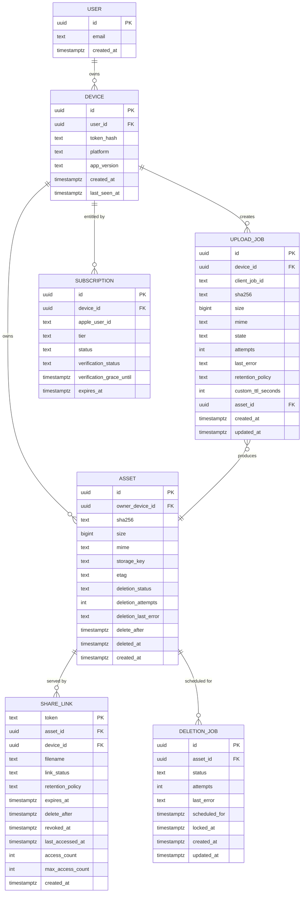

# Backend

Implementation notes for the Workers backend. Paired with [System design](./system-design.md), [Upload flow](./upload-flow.md), and [Data model](./data-model.md).

## Runtime

Cloudflare Workers with the Hono framework. One Worker per environment (`fastshared-api-stg`, `fastshared-api`). Wrangler handles deploys. No long-lived connections: Neon access uses the HTTP driver, uploads use signed R2/S3-compatible URLs, and downloads stream private R2 objects through the Worker. The same Worker additionally exports a `scheduled` handler for the cron triggers.

## Environment bindings

The `Env` interface exposed to handlers:

```ts
export interface Env {
  DATABASE_URL: string;
  R2_ACCOUNT_ID: string;
  R2_ACCESS_KEY_ID: string;
  R2_SECRET_ACCESS_KEY: string;
  R2_BUCKET_NAME: string;
  DEVICE_TOKEN_PEPPER: string;
  SHORT_LINK_HOST: string;
  PUBLIC_API_HOST: string;
  APP_ENV: string;
  APP_STORE_CONNECT_KEY_ID: string;
  APP_STORE_CONNECT_ISSUER_ID: string;
  APP_STORE_CONNECT_P8_KEY_BASE64: string;
  APPLE_BUNDLE_ID: string;
  DEV_PRO_APPLE_USER_IDS?: string;
  BETA_UNLIMITED_APPLE_USER_IDS?: string;
  RATE_LIMIT: KVNamespace;
  R2: R2Bucket;
}
```

Wrangler configuration supplies secrets via `wrangler secret put`. No secret is ever stored in `wrangler.toml`.

## Middleware pipeline

Order matters; each layer is small and testable on its own.

1. `requestId` — generates `req_<ulid>`, attaches to `c.var.requestId`, echoes as `X-Request-Id`.
2. `logger` — JSON log at end of request with `requestId`, route, status, durMs. Sensitive fields are redacted recursively.
3. `errorShape` — catches thrown `HttpError` subclasses and formats as RFC 7807.
4. `cors` — allow-list for `app://fastshared` and `https://fastsha.red`. The resolve route intentionally has no CORS.
5. `rateLimit` — KV-based, keyed by HMAC(device token/device id), IP (unauthed device mint), or HMAC(share token) on the resolve route.
6. `auth` — verifies bearer, loads `device` + `user`. Runs after rate limiting so hostile traffic pays less database cost. Skipped for `/s/:token` and `/v1/devices`.
7. `idempotency` — only on `POST /v1/uploads`; looks up `(device_id, client_job_id)` and short-circuits with a prior response when present.
8. Route handlers.

## Routes

| Method | Path                                  | Auth    | Rate limit               | Idempotent | Description                                                                                     |
| ------ | ------------------------------------- | ------- | ------------------------ | ---------- | ----------------------------------------------------------------------------------------------- |
| POST   | `/v1/devices`                         | no      | per-IP                   | no         | Mint a device token                                                                             |
| POST   | `/v1/uploads`                         | yes     | per-device               | yes        | Request a presigned PUT with `retentionPolicy`; returns `expiresAt`, `deleteAfter`              |
| POST   | `/v1/uploads/:id/complete`            | yes     | per-device               | yes        | Server verifies R2 object, creates asset + share_link; returns `token`, `linkStatus`, `expiresAt`, `deleteAfter`, `retentionPolicy` |
| GET    | `/v1/uploads/:id`                     | yes     | per-device               | -          | Poll upload status                                                                              |
| GET    | `/v1/history`                         | yes     | per-device               | -          | List user's share links, cursor-paginated; rows include `expiresAt`, `deleteAfter`, `linkStatus`, `retentionPolicy`, `accessCount` |
| POST   | `/v1/links/:token/revoke`             | yes     | per-device               | yes        | Owner-only; flips `link_status='revoked'`, schedules immediate deletion job                      |
| GET    | `/s/:token`                           | no      | per-IP (60/min) + per-token (300/min) | - | Anonymous resolve; streams private R2 object after DB validation; 410 Gone on expired/revoked/deleted; 404 on unknown |
| POST   | `/v1/report/:token`                   | no      | per-IP                   | -          | Abuse report (post-MVP-ready stub in MVP)                                                       |
| GET    | `/errors/:code`                       | no      | none                     | -          | RFC 7807 `type` explainer page                                                                  |
| GET    | `/health`                             | no      | none                     | -          | Liveness probe                                                                                  |

All handlers use `zod` for input validation and return typed responses.

Note: the resolve route is `/s/:token` (22-char base62), replacing the old `/s/:slug` contract. The column was renamed `share_link.slug → share_link.token`; migration is handled in `0001_ephemeral.sql`.

Every `/s/:token` response (including 410 and 404) carries:

```
Cache-Control: no-store
X-Robots-Tag: noindex, nofollow
Referrer-Policy: no-referrer
```

## Scheduled workers

The same Worker exports a `scheduled` handler. Three cron triggers in `wrangler.toml`:

| Cron           | Name                  | What it does                                                                                         | SLA / budget                                                                        |
| -------------- | --------------------- | ---------------------------------------------------------------------------------------------------- | ----------------------------------------------------------------------------------- |
| `*/1 * * * *`  | Deletion worker       | Drains due `deletion_job` rows. Deletes the R2 object, marks `asset.deleted_at`, advances the job.   | p99 deletion completion ≤ 5 min after `delete_after`                                |
| `0 * * * *`    | Reconciliation worker | Expires stale links (`linkStatus='active'` + `expiresAt <= now()`), enqueues missing deletion jobs, resets stuck `running` rows to `pending` (`locked_at < now() - 10 min`) | Runs < 30 s on healthy DB; alert if duration > 2 min                                |
| `0 3 * * 0`    | Multipart sweeper     | Aborts abandoned R2 multipart uploads older than 7 days via `AbortMultipartUpload`.                  | Runs < 5 min; best-effort, does not retry within the same invocation                |

Each cron dispatches through a switch inside `scheduled(event, env, ctx)` keyed by `event.cron`. Tests run each dispatcher directly with faked env and DB.

### Deletion service

`services/deletion.ts` implements the minute-cadence pick-and-process loop.

- **Picker**: `SELECT * FROM deletion_job WHERE status = 'pending' AND scheduled_for <= now() ORDER BY scheduled_for FOR UPDATE SKIP LOCKED LIMIT 50`. Uses a single transaction per batch; `SKIP LOCKED` lets multiple scheduled invocations never conflict.
- **Per-row**: mark `status='running'`, `locked_at=now()`. Issue R2 `DELETE object(storage_key)`. On 204 or 404, mark `asset.deleted_at=now()`, `asset.deletion_status='deleted'`, `deletion_job.status='done'`.
- **Backoff on failure**: `delay = 120 × 2^(attempts - 1)` seconds, cap `7200` seconds, jitter ±10%. Update `scheduled_for = now() + delay`, `attempts += 1`, `status='pending'`, `deletion_last_error=<short code>`.
- **Terminal failure**: after `attempts = 8`, set `deletion_job.status='failed'` and `asset.deletion_status='failed'`. Emit a structured log line at `error` level and fire a pager alert.
- **Idempotency**: the partial unique index `(asset_id) WHERE status IN ('pending','running')` guarantees a single active job per asset even under duplicate enqueues.

### Reconciliation

`services/reconciliation.ts` runs hourly with three passes in a single transaction batch:

1. **Expire stale links.** `UPDATE share_link SET link_status='expired' WHERE link_status='active' AND expires_at <= now()`. Drives the server-side truth; clients independently do `lazyMarkExpiredIfNeeded` on row render.
2. **Enqueue missing deletion jobs.** `INSERT INTO deletion_job (asset_id, scheduled_for, status) SELECT a.id, a.delete_after, 'pending' FROM asset a LEFT JOIN deletion_job dj ON dj.asset_id = a.id AND dj.status IN ('pending','running','done') WHERE a.deleted_at IS NULL AND a.delete_after <= now() + INTERVAL '1 hour' AND dj.id IS NULL ON CONFLICT DO NOTHING`. Partial unique index prevents duplicates.
3. **Reset stuck running jobs.** `UPDATE deletion_job SET status='pending', locked_at=NULL WHERE status='running' AND locked_at < now() - INTERVAL '10 minutes'`.
4. **Expire IAP verification grace.** Subscriptions in `verification_status='grace'` are marked expired when `verification_grace_until <= now()` unless a later verified App Store state has arrived.

A final pass is a short HEAD probe on a random sample of recently-verified assets whose `delete_after` has passed; if HEAD returns 404 we mark `asset.deletion_status='deleted'` and `asset.deleted_at=now()` without creating a duplicate R2 call.

## Drizzle schema overview



Full schema SQL lives in [Data model](./data-model.md).

## R2 access pattern

- **Writes.** Server presigns PUT with 5-minute TTL, content-length range, and fixed `Content-Type`. Client PUTs directly to R2; the Worker never sees bytes. Object key format: `a/<yyyy>/<mm>/<dd>/<device_id>/<asset_uuid>` (column name `storage_key`).
- **Reads.** Only via `GET /s/:token`. Handler loads `share_link` + `asset`, checks `link_status`, `expires_at`, and deletion state, then streams the object from private R2 with `Cache-Control: no-store`, `X-Robots-Tag: noindex, nofollow`, and `Referrer-Policy: no-referrer`. The browser never receives a raw R2 read URL.
- **Verification.** `POST /v1/uploads/:id/complete` issues an S3 HEAD against the object, compares `Content-Length` against the registered size, stores the returned `ETag` on the asset row, and rejects with `409` if the target `expires_at <= now()` (protects against zombie completes).
- **Deletes.** Deletion worker calls `DELETE object(storage_key)`. 404 is treated as success (already gone).
- **Bucket-level lifecycle rule.** `fastshared-*` buckets have a 90 d `Expire` lifecycle as a safety net. Configured via `wrangler r2 bucket lifecycle put`. This covers objects whose app-level deletion fails permanently.

## Neon usage

- HTTP driver (`@neondatabase/serverless`) because Workers cannot keep TCP pools warm.
- One connection per request, disposed at the end of the handler.
- Transactions used for the critical insert path in `complete` to keep `asset`, `share_link`, and the seed `deletion_job` atomic.
- The deletion worker also uses one connection per invocation and performs its batched `SELECT … FOR UPDATE SKIP LOCKED` inside a single short transaction.

## Rate limiting strategy

- KV namespace `RATE_LIMITS` with keys:
  - `rl:dev:<deviceHash>:<bucket>` — owner API per-device counters. `deviceHash` is `HMAC-SHA256(pepper, deviceId)` truncated; never the raw ID.
  - `rl:ip:<ip>:<bucket>` — per-IP counters (resolve + device mint).
  - `rl:tok:<tokenHash>:<bucket>` — per-token counters on resolve. `tokenHash` is `HMAC-SHA256(pepper, token)` truncated; never the raw token.
- Sliding window: two adjacent fixed windows summed with a weighting factor.
- **Resolve-route buckets**: per-IP `60/min`, per-token `300/min`. Whichever trips first returns `429` with `Retry-After`. Tuned to tolerate legitimate link-preview fan-out (one token visited by multiple messaging clients) while bounding enumeration.
- Upgrade path: when a hot token crosses 5 req/s sustained, move that token to a Durable Object keyed by `tokenHash` for precise counting. The API shape stays identical; the limiter is swappable behind a single interface.

## Token generation

- Alphabet: base62 (`0-9a-zA-Z`). **22 characters** — ~131 bits of entropy, comfortably above the 128 bits needed to make brute-force enumeration infeasible at 300 req/min per token.
- Generator: `crypto.getRandomValues(new Uint8Array(32))` then base62-encoded and truncated to 22 chars.
- Collision handling: try to reserve the token in `TOKEN_RESERVATIONS` KV with `put(token, "1", { expirationTtl: 60 })`; if already present, regenerate. Then insert into `share_link` with a unique index that will reject a concurrent collision. On conflict, regenerate again.
- No dictionary-derived tokens and no user-chosen tokens in MVP.
- Treat the token as a **bearer secret**: never log it in cleartext. The centralized logger redacts raw token-like fields, and rate-limit keys store HMAC digests only.

## Error shape

RFC 7807, always `application/problem+json`.

```json
{
  "type": "https://fastsha.red/errors/link-gone",
  "title": "Link is gone",
  "status": 410,
  "code": "link_gone",
  "reason": "expired",
  "detail": "This link expired at 2026-04-18T12:34:00Z.",
  "instance": "req_01HFXK..."
}
```

`reason` is one of `expired`, `revoked`, or `deleted` for the `410 Gone` case. Other notable codes: `rate_limited` (429), `upload_not_found` (404), `object_size_mismatch` (422), `link_not_found` (404), `complete_too_late` (409, raised when `expires_at <= now()`).

Known error types are catalogued in the source under `src/errors.ts`. `type` is always a real URL that resolves to a short explainer page served by `/errors/:code`.

## Logging

One JSON line per request:

```json
{
  "ts": "2026-04-19T12:34:56.789Z",
  "level": "info",
  "requestId": "req_01HFXK...",
  "route": "GET /s/:token",
  "status": 200,
  "durMs": 37
}
```

No PII. Device IDs, share tokens, bearer tokens, storage keys, asset IDs, and App Store transaction IDs are redacted before serialization; hashed counters are kept only in KV.

## Deployment

- `wrangler deploy` for production, `wrangler deploy --env staging` for staging.
- Secrets set via `wrangler secret put DATABASE_URL --env prod` etc.
- KV namespaces and R2 buckets are created separately for production and staging with `wrangler kv namespace create` and `wrangler r2 bucket create`; their ids are pasted into `wrangler.toml`.
- R2 lifecycle rule (90 d expire) configured with `wrangler r2 bucket lifecycle put` during M4.5.
- Cron triggers registered in `wrangler.toml` under `[triggers]` with the three expressions from the Scheduled workers table.
- Schema migrations run via `pnpm drizzle-kit migrate` against Neon, executed from a CI job (not from the Worker).
