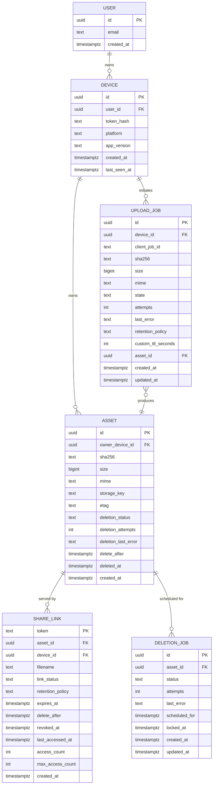
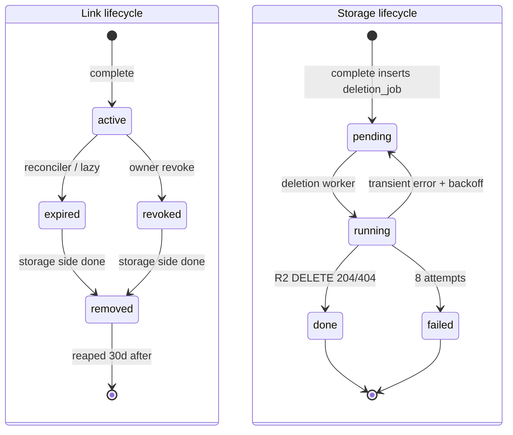

# Data model

The authoritative view of how data is shaped both server-side and client-side, and how the two halves line up.

Related: [Backend](./backend.md) for how rows are created, [Upload flow](./upload-flow.md) for how they move through states.

## Entity overview

- **`user`** — a person. In MVP there are no sign-ups; a `user` is auto-created on first device mint so the schema is already correct when accounts land.
- **`device`** — one Apple device belonging to a `user`. Holds the token hash and platform metadata. All owner requests authenticate as a device.
- **`asset`** — one object stored in R2. Uniqueness per owner is `(owner_device_id, sha256)` constrained to live rows (not deleted, not past `delete_after`).
- **`share_link`** — a 22-char base62 `token` that points at an asset. Many links can point at one asset (e.g. re-share with a different retention). Carries the link lifecycle (`active`/`expired`/`revoked`) and the retention policy.
- **`upload_job`** — the operational row created when the client starts a share. Lives until `completed`, `deduped`, or `failed`, then may be retained for a bounded window for audit.
- **`deletion_job`** — the operational row that drives the minute-cadence deletion worker. One active job per asset at a time, enforced by a partial unique index.

The system therefore has **three lifecycles**:

| Lifecycle      | Owner        | States                                                                               |
| -------------- | ------------ | ------------------------------------------------------------------------------------ |
| Upload job     | `upload_job` | `pending → presigned → uploading → verifying → completed` (or `deduped` / `failed`)  |
| Share link     | `share_link` | `active → expired` or `active → revoked`; transitions to `removed` when R2 object gone |
| Asset / object | `asset` + `deletion_job` | `pending → running → done` on the job side; `verified → deleted` (or `failed`) on the asset side |

The three are loosely coupled: a share link can be `revoked` while the asset's `deletion_job` still has hours to run; an asset can be `deleted` while multiple share_link tombstones still exist for the history UI.

## ER diagram



## Postgres schema

This is the canonical SQL, reflecting the merged state of `0000_init.sql` plus `0001_ephemeral.sql`. `backend/drizzle/` must match.

```sql
create extension if not exists "pgcrypto";

create table "user" (
  id uuid primary key default gen_random_uuid(),
  email text,
  created_at timestamptz not null default now()
);

create table device (
  id uuid primary key default gen_random_uuid(),
  user_id uuid not null references "user"(id) on delete cascade,
  token_hash text not null unique,
  platform text not null check (platform in ('ios','ipados','macos')),
  app_version text,
  created_at timestamptz not null default now(),
  last_seen_at timestamptz not null default now()
);
create index device_user_id_idx on device(user_id);

create table asset (
  id uuid primary key default gen_random_uuid(),
  owner_device_id uuid not null references device(id) on delete cascade,
  sha256 text not null,
  size bigint not null,
  mime text not null,
  storage_key text not null unique,
  etag text,
  delete_after timestamptz not null,
  deleted_at timestamptz,
  deletion_status text not null default 'pending'
    check (deletion_status in ('pending','scheduled','deleted','failed')),
  deletion_attempts int not null default 0,
  deletion_last_error text,
  created_at timestamptz not null default now()
);
create index asset_owner_device_idx on asset(owner_device_id);
-- Dedup only matches live assets (not deleted, not past delete_after).
create unique index asset_owner_sha_live_idx
  on asset(owner_device_id, sha256)
  where deleted_at is null and delete_after > now();
create index asset_delete_after_idx on asset(delete_after)
  where deleted_at is null;

create table share_link (
  token text primary key,
  asset_id uuid not null references asset(id) on delete cascade,
  device_id uuid not null references device(id) on delete cascade,
  filename text not null,
  link_status text not null default 'active'
    check (link_status in ('active','expired','revoked')),
  retention_policy text not null
    check (retention_policy in ('oneHour','oneDay','oneWeek','oneMonth','custom')),
  expires_at timestamptz not null,
  delete_after timestamptz not null,
  revoked_at timestamptz,
  last_accessed_at timestamptz,
  access_count int not null default 0,
  max_access_count int,
  created_at timestamptz not null default now()
);
create index share_link_device_created_idx on share_link(device_id, created_at desc);
create index share_link_asset_idx on share_link(asset_id);
-- Fast path for the reconciler expiry pass.
create index share_link_active_expires_idx
  on share_link(expires_at)
  where link_status = 'active';

create table upload_job (
  id uuid primary key default gen_random_uuid(),
  device_id uuid not null references device(id) on delete cascade,
  client_job_id text not null,
  sha256 text not null,
  size bigint not null,
  mime text not null,
  state text not null check (state in (
    'pending','presigned','uploading','verifying',
    'retry_scheduled','completed','deduped','failed'
  )),
  attempts int not null default 0,
  last_error text,
  retention_policy text not null
    check (retention_policy in ('oneHour','oneDay','oneWeek','oneMonth','custom')),
  custom_ttl_seconds int,
  asset_id uuid references asset(id) on delete set null,
  created_at timestamptz not null default now(),
  updated_at timestamptz not null default now(),
  unique (device_id, client_job_id)
);
create index upload_job_device_state_idx on upload_job(device_id, state);

create table deletion_job (
  id uuid primary key default gen_random_uuid(),
  asset_id uuid not null references asset(id) on delete cascade,
  status text not null default 'pending'
    check (status in ('pending','running','done','failed')),
  attempts int not null default 0,
  last_error text,
  scheduled_for timestamptz not null,
  locked_at timestamptz,
  created_at timestamptz not null default now(),
  updated_at timestamptz not null default now()
);
-- Idempotent enqueue: only one active job per asset at a time.
create unique index deletion_job_active_asset_idx
  on deletion_job(asset_id)
  where status in ('pending','running');
-- Hot path for the deletion worker picker.
create index deletion_job_due_idx
  on deletion_job(scheduled_for)
  where status = 'pending';
```

## Client SwiftData schema

Local mirror lives in the App Group store. Two models.

```swift
import Foundation
import SwiftData

@Model
public final class UploadJobEntity {
    @Attribute(.unique) public var clientJobId: UUID
    public var sha256: String
    public var size: Int64
    public var mime: String
    public var stagedPath: String?
    public var state: String            // pending | presigned | uploading | verifying | retry_scheduled | completed | deduped | failed
    public var attempts: Int
    public var lastError: String?
    public var serverUploadId: String?
    public var retentionPolicy: String  // oneHour | oneDay | oneWeek | oneMonth | custom
    public var customTtlSeconds: Int?
    public var expiresAt: Date?         // filled after presign
    public var deleteAfter: Date?       // filled after presign
    public var shortUrl: String?
    public var token: String?           // set on completion
    public var createdAt: Date
    public var updatedAt: Date

    public init(clientJobId: UUID, sha256: String, size: Int64, mime: String, retentionPolicy: String, customTtlSeconds: Int? = nil) {
        self.clientJobId = clientJobId
        self.sha256 = sha256
        self.size = size
        self.mime = mime
        self.state = "pending"
        self.attempts = 0
        self.retentionPolicy = retentionPolicy
        self.customTtlSeconds = customTtlSeconds
        self.createdAt = .now
        self.updatedAt = .now
    }
}
```

```swift
import Foundation
import SwiftData

@Model
public final class ShareLinkEntity {
    @Attribute(.unique) public var token: String
    public var shortUrl: String
    public var filename: String
    public var mime: String
    public var size: Int64
    public var retentionPolicy: String
    public var linkStatus: String        // active | expired | revoked | removed
    public var expiresAt: Date
    public var deleteAfter: Date
    public var revokedAt: Date?
    public var lastAccessedAt: Date?
    public var accessCount: Int
    public var createdAt: Date
    public var removedAt: Date?          // set when R2 object deleted (server-confirmed)

    public init(token: String, shortUrl: String, filename: String, mime: String, size: Int64,
                retentionPolicy: String, expiresAt: Date, deleteAfter: Date, createdAt: Date) {
        self.token = token
        self.shortUrl = shortUrl
        self.filename = filename
        self.mime = mime
        self.size = size
        self.retentionPolicy = retentionPolicy
        self.linkStatus = "active"
        self.expiresAt = expiresAt
        self.deleteAfter = deleteAfter
        self.accessCount = 0
        self.createdAt = createdAt
    }
}
```

## Mapping server to client

| Server field                    | Client field                          | Notes                                                  |
| ------------------------------- | ------------------------------------- | ------------------------------------------------------ |
| `upload_job.client_job_id`      | `UploadJobEntity.clientJobId`         | UUID string on wire, UUID on device                    |
| `upload_job.id`                 | `UploadJobEntity.serverUploadId`      | Stored only after presign                              |
| `upload_job.sha256`             | `UploadJobEntity.sha256`              | Lowercase hex                                          |
| `upload_job.size`               | `UploadJobEntity.size`                | Bytes                                                  |
| `upload_job.mime`               | `UploadJobEntity.mime`                |                                                        |
| `upload_job.state`              | `UploadJobEntity.state`               | Strings match exactly (incl. `deduped`, `failed`)      |
| `upload_job.attempts`           | `UploadJobEntity.attempts`            |                                                        |
| `upload_job.last_error`         | `UploadJobEntity.lastError`           | Short code + optional detail                           |
| `upload_job.retention_policy`   | `UploadJobEntity.retentionPolicy`     | Enum string                                            |
| `upload_job.custom_ttl_seconds` | `UploadJobEntity.customTtlSeconds`    | Only set when `retentionPolicy == "custom"`            |
| (derived, returned at presign)  | `UploadJobEntity.expiresAt`           | Server-authoritative                                   |
| (derived, returned at presign)  | `UploadJobEntity.deleteAfter`         | `expiresAt + 24h`                                      |
| `share_link.token`              | `ShareLinkEntity.token`               | 22 chars, base62                                       |
| `share_link.filename`           | `ShareLinkEntity.filename`            | Originating file name, for history UI                  |
| `share_link.link_status`        | `ShareLinkEntity.linkStatus`          | Client adds local-only `removed`                       |
| `share_link.retention_policy`   | `ShareLinkEntity.retentionPolicy`     |                                                        |
| `share_link.expires_at`         | `ShareLinkEntity.expiresAt`           | UTC                                                    |
| `share_link.delete_after`       | `ShareLinkEntity.deleteAfter`         | UTC                                                    |
| `share_link.revoked_at`         | `ShareLinkEntity.revokedAt`           | Null unless revoked                                    |
| `share_link.last_accessed_at`   | `ShareLinkEntity.lastAccessedAt`      | Updated on each `/s/:token` hit                        |
| `share_link.access_count`       | `ShareLinkEntity.accessCount`         |                                                        |
| `asset.size`                    | `ShareLinkEntity.size`                | Copied at creation so history doesn't need a join      |
| `asset.mime`                    | `ShareLinkEntity.mime`                | Copied at creation                                     |
| `share_link.created_at`         | `ShareLinkEntity.createdAt`           | UTC                                                    |
| (derived from asset.deleted_at) | `ShareLinkEntity.removedAt`           | Set client-side when history sees `deleted`            |

Short URL is `https://{SHORT_LINK_HOST}/s/{token}` and is stored on the client to avoid recomputing.

## Indexes and why

- `device(user_id)` — list devices for a user (admin, post-MVP).
- `device(token_hash)` unique — authentication lookup path, must be O(1).
- `asset_owner_sha_live_idx` **partial unique** on `(owner_device_id, sha256)` where `deleted_at IS NULL AND delete_after > now()` — dedup check on every fresh upload. Restricting to live rows means a deleted tombstoned asset never collides with a fresh upload of the same bytes, so re-uploads after expiry work correctly.
- `asset_delete_after_idx` on `(delete_after) WHERE deleted_at IS NULL` — used by the reconciler to find assets whose deletion job is about to be due.
- `share_link(device_id, created_at desc)` — history list endpoint, paginated.
- `share_link(asset_id)` — reverse lookup for takedown and for the deletion worker to mass-flip `link_status='removed'`.
- `share_link_active_expires_idx` on `(expires_at) WHERE link_status = 'active'` — the reconciler's expiry pass runs `UPDATE … WHERE link_status='active' AND expires_at <= now()`; this partial index keeps the pass cheap.
- `upload_job(device_id, state)` — resume-on-launch query finds all non-terminal jobs for a device.
- `upload_job(device_id, client_job_id)` unique — idempotency key.
- `deletion_job_active_asset_idx` **partial unique** on `(asset_id) WHERE status IN ('pending','running')` — guarantees a single active deletion job per asset even under racing enqueues.
- `deletion_job_due_idx` on `(scheduled_for) WHERE status = 'pending'` — the deletion worker picker sorts by `scheduled_for`; this partial index keeps each minute's pick O(log n) over pending rows only.

## Migration strategy

- Drizzle Kit generates SQL migrations into `backend/drizzle/`.
- `0000_init.sql` — baseline schema as of M4.
- `0001_ephemeral.sql` — rename `object_key → storage_key`, rename `slug → token`, add `link_status`/`retention_policy`/`expires_at`/`delete_after`/`revoked_at`/`last_accessed_at`/`access_count`/`max_access_count`/`deletion_status`/`deletion_attempts`/`deletion_last_error`, enforce `expires_at NOT NULL`, create `deletion_job`, swap dedup index to the partial-live-only form.
- Migrations run from CI against Neon, never from the Worker.
- Every migration is forward-only; rollbacks are done by a forward compensating migration.
- Before any destructive migration lands, a read-replica (Neon branch) is used to validate the query plan and run the migration in dry-run.

## Data lifecycle

Two parallel lifecycles, loosely coupled through the `asset` row.

**Link side** (`upload_job` → `share_link`):

1. `upload_job` is inserted in `pending` when presign is requested. `retention_policy` is set from the client request.
2. On a fresh upload, presign response carries `expiresAt`/`deleteAfter` computed from `retention_policy` (or clamped `customTtlSeconds`).
3. On successful `complete`, `asset` is inserted (or matched via the live partial unique index) and `share_link` is inserted with `link_status='active'`. `upload_job.state` becomes `completed` and `upload_job.asset_id` is set.
4. On dedup, `share_link` is inserted against an existing live asset; `upload_job.state` becomes `deduped`.
5. On permanent failure (incl. `complete_too_late`), `upload_job.state` becomes `failed`; no asset or share link is created.
6. Reconciler flips `share_link.link_status='active' → 'expired'` once `expires_at <= now()`.
7. Owner revoke flips `share_link.link_status='active' → 'revoked'` and pulls the associated `deletion_job.scheduled_for` forward to now.
8. Client marks `removedAt` when history confirms the underlying asset is gone (driven by the storage side below).
9. `upload_job` rows in terminal states are retained for 30 days for audit, then hard-deleted by the reconciler's housekeeping pass.

**Storage side** (`asset` + `deletion_job`):

1. `asset` row inserted at `complete`. `delete_after = expires_at + 24h`. `deletion_status='pending'`.
2. `deletion_job` row inserted in the same transaction with `status='pending'`, `scheduled_for = delete_after`.
3. Minute-cadence deletion worker flips `status='running'`, deletes the R2 object, then `status='done'`, and sets `asset.deleted_at`, `asset.deletion_status='deleted'`.
4. On transient error: `status` reverts to `pending` with a backoff-computed `scheduled_for`. `attempts += 1`.
5. After 8 failed attempts: `status='failed'`, `asset.deletion_status='failed'`. R2 lifecycle rule (90 d) is the long-tail safety net.
6. Reconciler resets stuck `running` jobs (`locked_at < now() - 10 min`) back to `pending`.


