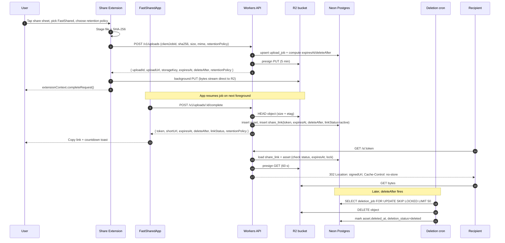

# System design

The canonical description of how FastShared is put together. Every other architecture doc links back here for shared definitions.

## Goals

1. **Ephemeral-first.** Every upload produces a temporary bearer link with a mandatory `expiresAt` and an automatic `deleteAfter` for the underlying R2 object. There is no permanent-hosting mode.
2. Single-gesture share on Apple platforms.
3. Upload completion survives extension teardown, app backgrounding, and short network drops.
4. Short link is on the clipboard within seconds of the share gesture for typical files.
5. No server-hosted file bytes transit the Worker: uploads go client → R2 directly, downloads go recipient → R2 via a 302 to a 60 s signed URL.
6. Schema and API shape are forward-compatible with accounts, teams, and per-link policy (password, max-downloads, geographic gates), even though MVP ships without them.

## Non-goals

- Real-time collaboration or presence.
- Cross-platform clients (Android, Windows, web beyond the redirect route and the minimal expired page).
- Permanent file hosting or permanent public URLs.
- Account-gated recipient access.
- Fully public CDN of raw objects.

## Runtime components

| Component       | Role                                                                                           |
| --------------- | ---------------------------------------------------------------------------------------------- |
| Apple client    | SwiftUI app + share extension + local Swift package `FastSharedCore`                           |
| Workers API     | Hono app on Cloudflare Workers; handles auth, presign, metadata, `/s/:token` resolve, revoke   |
| Workers cron    | Scheduled handlers for deletion, reconciliation, and weekly multipart sweeps                   |
| R2              | Private bucket `fastshared-prod`; all reads via 60 s presigned GET; lifecycle rule as safety net |
| Neon Postgres   | Source of truth for users, devices, assets, share links, upload jobs, deletion jobs            |
| KV (Cloudflare) | Rate-limit counters (per-IP + per-token on resolve) and token reservation                      |

See [Apple client](./apple-client.md) and [Backend](./backend.md) for per-component detail.

## End-to-end sequence

The happy path: user picks a retention policy, file streams to R2, `/complete` mints the token, recipient opens the link, cron reaps the object after expiry + grace period.



## Cross-cutting concerns

### Ephemerality & deletion

The lifecycle is split into two halves — a **link lifecycle** and an **object lifecycle** — because the link can be expired or revoked independently of the storage object, but the object is always removed after a bounded grace period.

| Concern                 | Behavior                                                                                              | Why                                                                                       |
| ----------------------- | ----------------------------------------------------------------------------------------------------- | ----------------------------------------------------------------------------------------- |
| Link lifecycle          | `active → expired` at `expiresAt`; `active → revoked` on owner action. Both terminal once deleted.    | Lets owners kill a link mid-life without waiting for storage deletion.                    |
| Object lifecycle        | `pending → verified → deleted` via `deletion_job`; `deleteAfter = expiresAt + 24 h` grace period.     | Grace period lets a user spot an accidental expiry and recover the link before bytes go.  |
| Retention mechanism     | **Hybrid**: app-level `deletion_job` cron (authoritative) + R2 lifecycle rule 90 d (safety net) + weekly multipart sweeper. | App-level gives minute-granularity retention; R2 rule catches orphans from app-level bugs. |
| Anonymous resolve       | `/s/:token` is unauthenticated, 302s to a fresh 60 s signed R2 GET.                                   | Owner-controlled route enables mid-life revoke, rate limiting, and future per-link policy. |
| Abuse controls          | Per-IP 60/min and per-token 300/min rate limits on `/s/:token`; `no-store`, `noindex, nofollow`, `no-referrer` headers. | Anonymous bearer model implies the token is the only access control; bound blast radius.  |

Rejected alternatives (documented so we do not re-debate them):

- **Direct public R2 URL** — permanent exposure, no revoke/expire control, no rate limiting.
- **Signed R2 URL returned directly to the client** — the signed URL would leak-while-valid; we cannot revoke it mid-life.
- **Workers proxy/streaming of bytes** — enables per-link flip for password/max-downloads/geo, but Workers CPU limits make this unsafe for large videos in MVP. Kept as a post-MVP lever.
- **R2 lifecycle alone** — day granularity is too coarse for the 1 h preset and cannot express the 24 h grace period.
- **App-level deletion alone** — no safety net for orphaned objects if the cron fails silently.

### Auth

Per-device bearer tokens gate the **owner API** (upload, history, revoke). First launch does `POST /v1/devices` with a device nonce. Server returns `{ deviceId, token }`. Token is stored in the shared Keychain group `TEAMID.com.yourco.fastshared` so the app and extension share it. Server stores `HMAC-SHA256(pepper, token)`; plaintext never persists.

The recipient-facing route `/s/:token` is **unauthenticated** and uses the share token as a bearer secret. See [Security](./security.md).

### Idempotency

`POST /v1/uploads` is keyed by `(device_id, client_job_id)`. A retried request for the same pair returns the original response. Applies equally to the retention fields: a retry does not re-pick a shorter policy.

### Rate limiting

- Per device (owner API): 60 uploads/hour, 600 history reads/hour. Enforced via KV counters.
- Per IP (for unauthenticated endpoints `POST /v1/devices`): 120/hour.
- Per IP and per token on `/s/:token`: **60/min per IP** and **300/min per token**, whichever trips first.
- On limit, respond `429` with RFC 7807 body and `Retry-After` header. Upgrade path is a Durable Object per token once KV latency becomes a problem.

### Error shape

All errors follow RFC 7807:

```json
{
  "type": "https://fsh.re/errors/link-gone",
  "title": "Link is gone",
  "status": 410,
  "code": "link_gone",
  "reason": "expired",
  "detail": "This link expired at 2026-04-18T12:34:00Z.",
  "instance": "req_0FV7..."
}
```

`410 Gone` is used for `expired`, `revoked`, and `deleted`. See [Backend](./backend.md) for the full catalog.

### Observability

- Client uses `OSLog` with subsystem `com.yourco.fastshared` and categories `upload`, `extension`, `ui`, `net`, `storage`.
- Server emits one JSON line per request with `requestId`, `deviceId` (hashed), `route`, `durMs`, `status`, and `err` when relevant.
- **Token hygiene**: the token is never logged in cleartext. Logs truncate to `token[:8]…`.

### Sync strategy

MVP is single-device. SwiftData is the local source of truth for UI; a lazy `markExpiredIfNeeded` helper transitions rows locally on read. The server is the source of truth for assets, links, and deletion state. No client-to-client sync beyond iCloud Keychain sharing the device token across the user's Apple ID.

## Deployment topology

- **Cloudflare Workers** hosts the Hono app. One worker per environment. Custom routes:
  - `api.fsh.re/*` (prod), `api.fsh.dev/*` (dev) — JSON API.
  - `fsh.re/s/*` (prod), `fsh.dev/s/*` (dev) — resolve handler (302 to 60 s signed GET).
- **Workers cron triggers** — three schedules on the same Worker:
  - `*/1 * * * *` — deletion worker, drains `deletion_job` rows due for processing.
  - `0 * * * *` — reconciliation worker, expires stale links, enqueues missing deletion jobs, resets stuck running jobs.
  - `0 3 * * 0` — multipart sweeper, aborts abandoned R2 multipart uploads (Sun 03:00 UTC).
- **R2** holds all object bytes. Bucket is private; only the Worker can presign. A bucket-level lifecycle rule (TTL 90 d) is configured as a safety net.
- **Neon** holds metadata. Connected via the Neon HTTP driver with a connection per request (no pooling in Workers).
- **KV** stores rate-limit counters and token reservations for collision avoidance.

## Environments

| Env  | API host         | Short link host | R2 bucket         | Neon branch |
| ---- | ---------------- | --------------- | ----------------- | ----------- |
| dev  | api.fsh.dev      | fsh.dev         | fastshared-dev    | dev         |
| prod | api.fsh.re       | fsh.re          | fastshared-prod   | main        |

## Failure modes

| Failure                                   | Impact                                  | Recovery                                                                                                 |
| ----------------------------------------- | --------------------------------------- | -------------------------------------------------------------------------------------------------------- |
| Extension killed mid-presign              | Job stuck in `pending`                  | App resumes on launch, re-issues `POST /v1/uploads` with same `clientJobId` (idempotent)                 |
| PUT to R2 fails with 5xx                  | Upload transitions to `retry_scheduled` | Exponential backoff (2s base, cap 60s, jitter), max 8 attempts, then `failed`                            |
| `complete` call lost after successful PUT | No token returned                       | App retries `complete`; server verifies via HEAD and returns existing token if already inserted          |
| Neon down                                 | API returns 503 on all writes           | Client keeps jobs in `pending`; retries on launch and foreground                                         |
| R2 HEAD reports wrong size                | Upload rejected                         | Server marks `failed`, client surfaces error, user can retry                                             |
| KV rate limit counter corrupted           | Over- or under-limiting                 | Counters are best-effort; incident response widens the window and investigates                           |
| Token collision                           | Never returned to client                | Server reserves token in KV + transactional insert with unique index; on conflict, regenerate            |
| Device token leak                         | Attacker can upload on behalf of user   | Server supports token rotation via `POST /v1/devices/:id/rotate` (post-MVP)                              |
| Deletion job fails 8x                     | Object remains in R2 beyond `deleteAfter` | Terminal `deletion_status='failed'`; pager fires; R2 lifecycle rule (90 d) still eventually reaps it    |
| R2 object missing while DB still `verified` | `/s/:token` returns 502 on GET         | Hourly reconciler notices `deleteAfter` past or a HEAD miss and marks the asset `deleted`               |
| Upload completes after link already expired | Late user lands on a just-created expired link | `POST /v1/uploads/:id/complete` rejects with `409` when server sees `expiresAt <= now() + 60s`        |
| Signed GET URL leaks from 302 `Location`  | Someone can replay the signed URL       | Bounded by the 60 s TTL; resolve endpoint is rate-limited per-IP and per-token to dampen replay at scale |

## Key decisions

- **Ephemeral by design.** The entire data model assumes every object has a `deleteAfter`. This eliminates a class of GDPR/erase-me requests and keeps storage cost proportional to active use.
- **App-owned `/s/:token` → 302 to 60 s signed GET.** Keeps R2 private, gives us mid-life revoke and per-link policy hooks, and avoids streaming bytes through Workers.
- **Hybrid retention mechanism.** App-level cron is authoritative (minute-granularity); R2 lifecycle is the safety net; weekly multipart sweeper mops abandoned multipart uploads.
- **Device token, not accounts.** Ships the MVP in weeks instead of months; schema already includes `user` so accounts can layer on without migration.
- **SwiftData over Core Data.** Modern, compile-time schema, and shared-store ergonomics are better for an App Group. Trade-off: macOS 14 / iOS 17 minimum.
- **Background URLSession shared between extension and app.** The share extension has seconds of runtime; background sessions survive its death and deliver completion to the app.
- **Hono on Workers.** Minimal framework, first-class Workers types, trivially fast cold starts.
- **Drizzle with Neon HTTP driver.** Gives us type-safe SQL without long-lived pools.

For the full trade-off list, see the Key decisions tables inside [Backend](./backend.md) and [Apple client](./apple-client.md).
