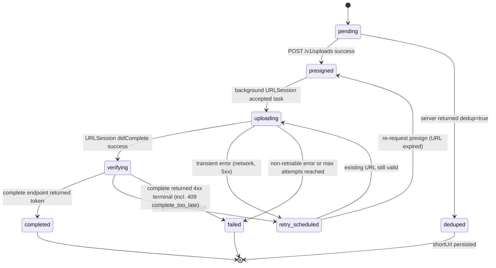
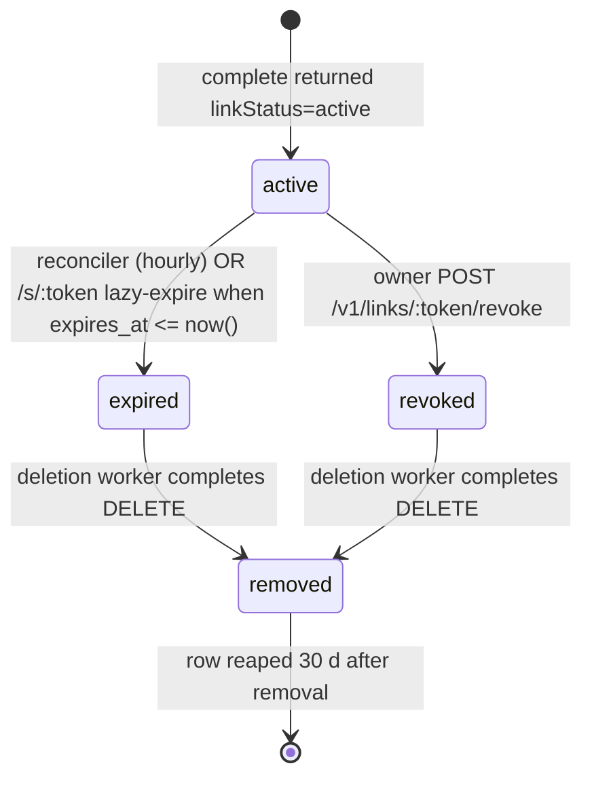
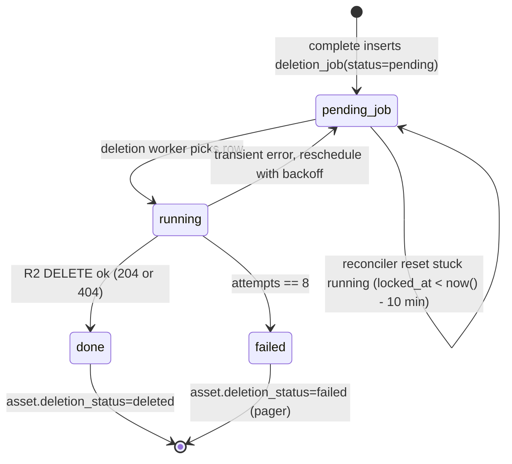

# Upload flow

This is the most load-bearing document in the repo. Every feature, every bug, and every on-call incident will come back here. Keep it exact.

Companion docs: [System design](./system-design.md), [Apple client](./apple-client.md), [Backend](./backend.md).

## Overview

A single upload is a four-phase operation, with two additional ephemeral lifecycles layered on top.

1. **Stage** — the extension copies the incoming file to the App Group's staging directory and computes its SHA-256 as it streams.
2. **Presign** — the client calls `POST /v1/uploads` with the hash, size, mime, idempotency key, **and a retention policy**. Response carries either a presigned PUT URL or a dedup hit, plus `expiresAt` and `deleteAfter`.
3. **Transfer** — the client PUTs the file directly to R2 via a background `URLSession`.
4. **Complete** — the client calls `POST /v1/uploads/:id/complete`; the server HEADs R2, writes `asset`, `share_link`, and the seed `deletion_job`, and returns `token`, `shortUrl`, `expiresAt`, `deleteAfter`, `linkStatus`, `retentionPolicy`.

Layered on top are:

- The **link lifecycle** (`active → expired` or `revoked`).
- The **object lifecycle** (`verified → deleted`), driven by the minute-cadence deletion worker.

The entire flow is designed so that any step can be re-run safely.

## Step-by-step sequence

```mermaid
sequenceDiagram
    autonumber
    participant SE as Share Extension
    participant AG as App Group
    participant Bg as Background URLSession
    participant App as FastSharedApp
    participant API as Workers API
    participant R2 as R2
    participant DB as Postgres
    participant Cron as Deletion cron

    SE->>AG: Stream file + SHA-256
    SE->>AG: Insert UploadJobEntity(pending, retentionPolicy)
    SE->>API: POST /v1/uploads (clientJobId, sha256, size, mime, retentionPolicy, customTtlSeconds?)
    API->>DB: upsert upload_job (device_id, client_job_id)
    API->>DB: SELECT asset WHERE owner_device_id AND sha256 AND deleted_at IS NULL AND delete_after > now()
    alt dedup hit (live asset)
        API->>DB: insert share_link(token, expires_at, delete_after, retention_policy)
        API-->>SE: 200 { dedup: true, token, shortUrl, expiresAt, deleteAfter, linkStatus, retentionPolicy }
        SE->>AG: state=deduped, token+expiresAt+deleteAfter set
    else fresh
        API->>R2: presign PUT (5 min)
        API-->>SE: 200 { uploadId, uploadUrl, storageKey, expiresAt, deleteAfter, retentionPolicy }
        SE->>AG: state=presigned, serverUploadId+expiresAt+deleteAfter set
        SE->>Bg: uploadTask(with: request, fromFile: stagedURL)
        SE-->>SE: extensionContext.completeRequest()
    end
    Note over Bg,R2: Bytes stream from device to R2 directly
    Bg->>Bg: urlSession(_:task:didCompleteWithError:) fires in app
    App->>API: POST /v1/uploads/:id/complete
    API->>R2: HEAD storageKey
    R2-->>API: size, etag
    alt expires_at <= now()
        API-->>App: 409 complete_too_late
    else ok
        API->>DB: BEGIN; upsert asset; insert share_link(token); insert deletion_job(asset_id, scheduled_for=delete_after); COMMIT
        API-->>App: 200 { token, shortUrl, expiresAt, deleteAfter, linkStatus, retentionPolicy }
        App->>AG: state=completed, token/shortUrl/expiresAt set
        App->>App: Copy shortUrl to pasteboard, show countdown toast
    end
    opt owner revokes
        App->>API: POST /v1/links/:token/revoke
        API->>DB: UPDATE share_link SET link_status='revoked', revoked_at=now()
        API->>DB: UPDATE deletion_job SET scheduled_for=now() WHERE asset_id=? AND status='pending'
        API-->>App: 200
    end
    Note over DB,Cron: Later: deleteAfter fires (or revoke pulled it in)
    Cron->>DB: SELECT deletion_job FOR UPDATE SKIP LOCKED LIMIT 50
    Cron->>R2: DELETE storageKey
    Cron->>DB: mark asset.deleted_at, deletion_status=deleted, deletion_job.status=done
```

## Upload job state machine



Triggers per transition:

- `pending → presigned` — `POST /v1/uploads` returned `200` with a URL.
- `pending → deduped` — `POST /v1/uploads` returned `200` with `dedup: true`; row never transfers bytes.
- `presigned → uploading` — `URLSession.uploadTask(...).resume()` did not throw.
- `uploading → verifying` — session delegate reports success.
- `uploading → retry_scheduled` — transient failure; next attempt scheduled with backoff.
- `retry_scheduled → presigned` — attempt starts after URL TTL expired; re-request.
- `retry_scheduled → uploading` — attempt starts before TTL; reuse URL.
- `verifying → completed` — `complete` endpoint returned `200` and the client has stored the token.
- `* → failed` — non-retriable error (413, 415, 422, **409 `complete_too_late`**) or attempts exhausted. Terminal.

## Share link state machine



Triggers per transition:

- `active → expired` — hourly reconciler runs `UPDATE … SET link_status='expired'`. A `/s/:token` request can also lazy-expire a row inline if it sees `expires_at <= now()` and `link_status='active'`.
- `active → revoked` — owner calls `POST /v1/links/:token/revoke`; the server also pulls the `deletion_job.scheduled_for` forward to now so the object is removed within a minute.
- `expired → removed` / `revoked → removed` — driven by the `deletion_job` lifecycle below; once the R2 object is deleted, the link is `removed`.
- `removed → [*]` — tombstone reaped 30 d after removal by the reconciler's housekeeping pass.

## Asset deletion lifecycle



Triggers per transition:

- `[*] → pending_job` — `/complete` inserts the job with `scheduled_for = delete_after`.
- `pending_job → running` — deletion worker `SELECT … FOR UPDATE SKIP LOCKED` flips `status='running'`, `locked_at=now()`.
- `running → done` — R2 DELETE returns 204 (success) or 404 (already gone). Asset row gets `deleted_at=now()`, `deletion_status='deleted'`.
- `running → pending_job` — R2 5xx / network error; backoff `120 × 2^(attempts-1) s` up to 7200 s, jitter ±10%, update `scheduled_for`.
- `running → failed` — 8 attempts exhausted. Terminal; requires manual investigation. R2 lifecycle rule (90 d) remains the safety net.

## Extension staging details

- File bytes are streamed with `InputStream` / `OutputStream` in 1 MB chunks so a 2 GB video never lives fully in memory.
- `CryptoKit.SHA256` is updated per chunk; final digest is base16-encoded.
- Staging path: `group.com.yourco.fastshared/Caches/Staging/<uuid>.part` — atomically renamed to `<uuid>` when the copy finishes. If the extension crashes mid-copy, the `.part` is ignored on next scan and reaped after 24 h.

## Presign request payload

```json
{
  "clientJobId": "5F9D6EFB-9B02-45E5-82C8-3C7B1F04CDFE",
  "sha256": "2c26b46b68ffc68ff99b453c1d30413413422d706483bfa0f98a5e886266e7ae",
  "size": 1048576,
  "mime": "image/png",
  "filename": "screenshot.png",
  "retentionPolicy": "oneDay",
  "customTtlSeconds": null
}
```

`retentionPolicy` is one of `oneMinute` (60s), `oneHour` (3600s), `oneDay` (86400s, **default**), `oneWeek` (604800s), `oneMonth` (2592000s), `custom`. `customTtlSeconds` is required when `retentionPolicy == "custom"` and is clamped server-side to `[300, 2592000]`.

Response (fresh):

```json
{
  "uploadId": "9c1d5c20-5d4a-4b4a-aa24-6f01e9c57f4e",
  "uploadUrl": "https://<accountid>.r2.cloudflarestorage.com/fastshared-prod/a/2026/04/19/<devid>/<assetuuid>?X-Amz-...",
  "storageKey": "a/2026/04/19/<devid>/<assetuuid>",
  "expiresAt": "2026-04-20T12:40:00Z",
  "deleteAfter": "2026-04-21T12:40:00Z",
  "retentionPolicy": "oneDay"
}
```

Response (dedup hit against a live asset):

```json
{
  "uploadId": "9c1d5c20-...",
  "dedup": true,
  "token": "aB3dG7kP9qR2sT4uV6wX8y",
  "shortUrl": "https://fastsha.red/s/aB3dG7kP9qR2sT4uV6wX8y",
  "expiresAt": "2026-04-20T12:40:00Z",
  "deleteAfter": "2026-04-21T12:40:00Z",
  "linkStatus": "active",
  "retentionPolicy": "oneDay"
}
```

## Complete response

```json
{
  "uploadId": "9c1d5c20-...",
  "token": "aB3dG7kP9qR2sT4uV6wX8y",
  "shortUrl": "https://fastsha.red/s/aB3dG7kP9qR2sT4uV6wX8y",
  "expiresAt": "2026-04-20T12:40:00Z",
  "deleteAfter": "2026-04-21T12:40:00Z",
  "linkStatus": "active",
  "retentionPolicy": "oneDay"
}
```

## Background URLSession handoff

- Extension builds the request, calls `resume()` on the `uploadTask`, then `completeRequest`.
- The background daemon owns the transfer. If the app is not running, iOS enqueues a delivery event.
- On next app launch (or the daemon waking the app), `application(_:handleEventsForBackgroundURLSession:completionHandler:)` fires. We stash the completion block.
- `FastSharedCore` re-instantiates the shared session with identifier `com.yourco.fastshared.upload` and its delegate. The system immediately replays pending completion events. When `urlSessionDidFinishEvents(forBackgroundURLSession:)` fires, we invoke the saved block.

## Completion + verification

- App calls `POST /v1/uploads/:id/complete` with the `uploadId` returned at presign.
- Server fetches `upload_job`, confirms it belongs to the caller's device, and issues S3 HEAD against `storage_key`.
- If `Content-Length != upload_job.size`, respond 422 `object_size_mismatch` and mark the job `failed`.
- If `expires_at <= now()`, respond 409 `complete_too_late` and mark the job `failed`. (See "Resume + expiration edge cases" below.)
- Else, start a transaction: upsert `asset` on `(owner_device_id, sha256)` filtered to live rows; insert `share_link` with a fresh token, `link_status='active'`, `expires_at`, `delete_after`, `retention_policy`; insert `deletion_job(asset_id, scheduled_for=delete_after, status='pending')`; commit. Return the completion DTO.
- Dedup path (two fast retries racing) is safe because the `asset` upsert key is `(owner_device_id, sha256)` and the partial unique index on `deletion_job` prevents duplicate scheduling.

## Multipart strategy

For files larger than the server multipart threshold (currently 10 MB):

1. `POST /v1/uploads` sees `size > 100 MB` and returns `{ mode: "multipart", uploadId, parts: [{ partNumber, uploadUrl }...], completeUrl }` plus the usual `expiresAt`/`deleteAfter`.
2. Server initiates an R2 multipart upload and presigns each part URL.
3. Client uploads parts in parallel (max 3 in-flight) using the same background session.
4. Client calls `completeUrl` with `{ partNumber, etag }[]`; server completes the multipart upload against R2 and then runs the same HEAD + insert path.
5. The state machine above gains `uploading_parts` and `completing_multipart` substates. Retries are per-part.
6. Abandoned multipart uploads are reaped weekly by the multipart sweeper cron.

The `POST /v1/uploads` response shape uses a `mode` discriminator so the client can branch between single PUT and multipart without guessing from file size.

## Retry policy

- Base delay 2 seconds.
- Exponential multiplier 2.
- Cap 60 seconds.
- Full jitter: `delay = random_between(0, min(cap, base * 2^attempt))`.
- Max attempts 8.
- Retriable: network errors, HTTP 5xx, HTTP 408, HTTP 429 (respect `Retry-After`).
- Permanent: HTTP 400, 401, 403, 409 (`complete_too_late`), 413, 415, 422; SHA-256 mismatch on HEAD.

## Idempotency (`clientJobId`)

- Client generates a UUIDv4 before the first `POST /v1/uploads`.
- Server stores it on `upload_job` with `UNIQUE (device_id, client_job_id)`.
- A retried `POST /v1/uploads` with the same pair returns the prior response (presign URL regenerated if expired; `uploadId`, `retentionPolicy`, `expiresAt`, `deleteAfter` stable).

## Dedup (`sha256`)

- After the job row is created or updated, the server looks up `asset WHERE owner_device_id = ? AND sha256 = ? AND deleted_at IS NULL AND delete_after > now()` — dedup only matches **live** assets.
- If found, respond with `dedup: true` and a newly minted `share_link` pointing at that asset. No R2 round trip. The new link gets its own `expires_at`/`delete_after` based on the caller's `retentionPolicy` — existing siblings are untouched.
- When an asset is deleted, a subsequent upload of identical bytes will simply create a fresh asset row and object; the old row stays tombstoned.
- Cross-device dedup is out of scope for MVP.

## Resume on launch

On app launch, `FastSharedCore` scans `UploadJobEntity` for states `pending`, `presigned`, `uploading`, `retry_scheduled`, `verifying`:

- `pending` — re-request presign (idempotent).
- `presigned` — if URL expired, re-request; otherwise re-enqueue to the background session.
- `uploading` — bind to whatever task the background session reports.
- `retry_scheduled` — fire when its delay elapses.
- `verifying` — retry `complete`.

Any staged file older than 72 h whose job is still not `completed`/`deduped`/`failed` is reaped and the job marked `failed`.

## Deletion lifecycle

The deletion lifecycle is the second half of the ephemeral story. It is deliberately split from link expiry so owners can kill a link mid-life without waiting for storage.

- **Grace period.** `deleteAfter = expiresAt + 24h`. The 24 h window gives an accidentally-expired share room to recover: we can add a post-MVP "undo expire" path that bumps `expires_at` forward so long as `delete_after` hasn't elapsed. Minute-granularity retention comes from the minute-cadence cron; the grace period absorbs scheduler drift.
- **Retry math.** `delay = 120 × 2^(attempts - 1)` seconds, capped at 7200 s, jitter ±10%, max 8 attempts. Totals roughly 4 h of effort across 8 attempts; terminal `failed` at that point. R2 lifecycle (90 d) is the long-tail safety net.
- **Reconciler role.** Hourly pass expires stale links, seeds missing `deletion_job` rows, resets stuck `running` rows (`locked_at < now() - 10 min`), and (sampled) HEADs objects past `delete_after` to notice silent cron failures.
- **R2 lifecycle rule (safety net).** Bucket-level 90 d expire runs regardless of app-level state. Prevents orphaned objects from living forever if the app-level deletion pipeline breaks.
- **Multipart sweeper.** Weekly (`0 3 * * 0`) `AbortMultipartUpload` against any in-flight multipart upload older than 7 days. Keeps multipart orphans off the bill.
- **Revoke pulls deletion forward.** `POST /v1/links/:token/revoke` updates the pending `deletion_job.scheduled_for = now()`, which means the deletion worker picks it up within a minute.

## Resume + expiration edge cases

Three corner cases worth calling out explicitly.

1. **App launches 3 days after a share was enqueued.** If the job is still pending and the target `delete_after` has already elapsed, the job is purged on the resume scan and marked `failed`. Staged file is reaped. The share would have been dead by now anyway.
2. **Presign arrives after link already expired.** Shouldn't happen for a fresh job (server computes `expiresAt` *at* presign). It can happen if the client times out and retries after a long gap: the retry path sees a stale cached `expiresAt` in the SwiftData row. Server is authoritative and rejects the `/complete` call with `409 complete_too_late` when `expires_at <= now()`.
3. **User closes app mid-upload.** The background `URLSession` continues. When the app is relaunched and `/complete` fires, one of three things happens:
   - `expires_at > now()` — complete succeeds normally.
   - `expires_at <= now()` — server rejects with 409; job marked `failed`.
   - Complete was previously attempted and persisted a token but the client never saw the response — the `upload_job` row already has `state='completed'` and the server returns the same DTO (idempotent).

   **Minor footgun**: a sufficiently long background upload with a short `oneMinute` retention can land on an already-past `expires_at` if we did not re-validate. Mitigation: the **server re-validates `expiresAt > now()` on complete** and rejects; the client surfaces a "this share expired before it could finish uploading" error with a retry affordance that presigns afresh.

## Failure handling

- **From the extension.** Most interesting because the extension cannot display errors. Failures here transition the job to `failed` with a short `lastError` string; the main app surfaces them later via a history row badge.
- **From the app.** Transient errors transition to `retry_scheduled` and schedule a timer. The app shows a subtle "Retrying..." state in history.
- **From R2.** HEAD size mismatch is permanent; HEAD 404 (object not uploaded) transitions back to `presigned` for one more attempt, then permanent.
- **From the deletion worker.** Transient R2 errors re-schedule with backoff; `404 NotFound` on DELETE is treated as success (already gone); 8 attempts worth of genuine 5xx ends in terminal `failed` with an alert.

## Avoiding duplicate uploads on retried shares

Two defenses:

1. **Idempotency key.** The extension persists `clientJobId` in the SwiftData row *before* the first API call. A retry uses the same key.
2. **Pre-presign dedup.** Server's lookup of `(owner_device_id, sha256)` short-circuits on known live content even if the client failed to persist its key.

Together, either a lost key or a lost hash produces the same token (for retries within idempotency window) or a duplicate-content dedup hit.

## Test strategy

- **Unit tests** for retry math, state machine transitions, token format, retention clamping (`FastSharedCoreTests`, `backend/src/**/*.test.ts`).
- **Integration tests** with a mock Workers and a stub S3 endpoint, executing the full sequence on synthetic files. Includes a `/s/:token` redirect test and a 410-on-expired test.
- **Deletion-worker tests** drive the `scheduled` handler directly with a faked env; verify backoff math, terminal failure path, and `FOR UPDATE SKIP LOCKED` behavior under concurrent invocations.
- **Soak test** (pre-release, manual): enqueue 200 jobs across three file sizes with staggered retentions, randomly kill and foreground the app and the extension, verify zero duplicate tokens, zero stuck jobs, and zero objects still live past `deleteAfter + 10min`.
- **Network chaos** (staging): use Network Link Conditioner profiles to exercise retry/backoff paths.
